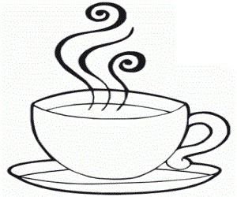

<!DOCTYPE html>

<html>

<link rel="stylesheet" href="https://cdn.jsdelivr.net/gh/devicons/devicon@v2.15.1/devicon.min.css">
          
**
<head>
  <h1> Machado Developer's </1>
</head>

<body>

<h1>Bem-vindo!</h1>

Essa é a página de um estudante de programação. Sinta-se em casa!

<h2>Importante Saber</h2>

 Estou iniciando minha jornada de programação disposto a aquirir <i> "conhecimentos" </i> necessários para me tornar um desenvolvedor <b> Back-End </>.

</body>
</html>
